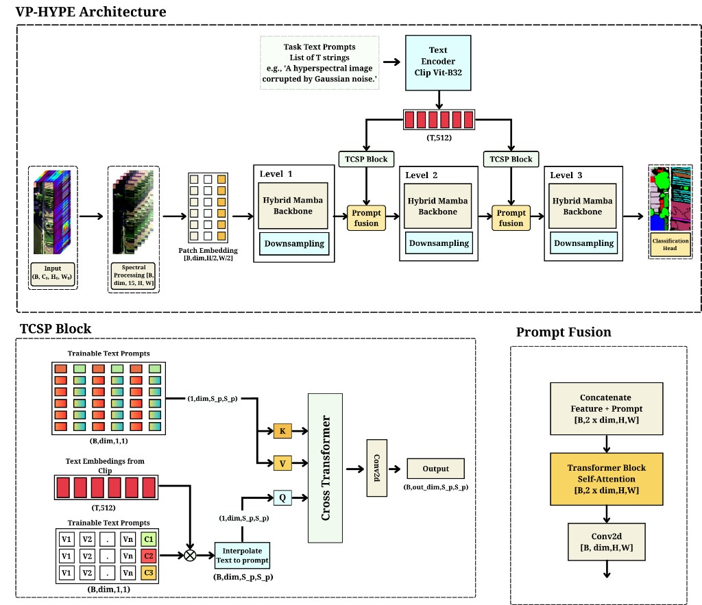
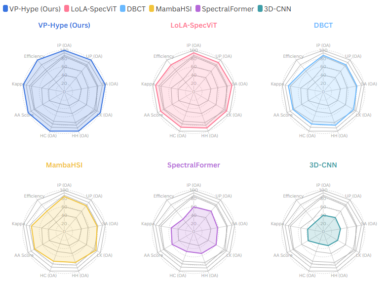

## VP HYPE

This repository contains the official implementation for the **VP HYPE** article, built on top of NVIDIA's Mamba-based vision architecture.

The core model code lives in `models/mamba_vision2.py`, which defines the multi-scale MambaVision backbone and its model variants (`mamba_vision_T`, `mamba_vision_S`, `mamba_vision_B`, `mamba_vision_L`, etc.), as well as an optional hyperspectral adaptor for HSI inputs.

### Architecture

The high-level VP HYPE architecture, including the textual-visual TCSP blocks and prompt fusion, is illustrated below:



### Key Components

- **`models/mamba_vision2.py`**: Main VP HYPE backbone, including
  - `MambaVisionMixer` (Mamba-based sequence mixer)
  - `MambaVisionLayer` (hierarchical stages with windowed processing)
  - `MambaVision` (full backbone with classifier head and HSI adaptor)
- **`configs/`**: Example YAML configs for different model scales.
- **`scheduler/`**: Learning-rate schedulers used in training.
- **`utils/`**: Dataset and training utilities.

### Environment & Dependencies

You will need at least:

- Python 3.10+
- PyTorch with CUDA support
- `timm`, `mamba-ssm`, `einops`

You can either install dependencies **directly on your host**, or run everything inside a **Docker** container.

#### Host (pip) setup

Install dependencies with `pip` (adjust versions as needed):

```bash
pip install torch torchvision --index-url https://download.pytorch.org/whl/cu121
pip install timm mamba-ssm einops
```

#### Docker setup

Build the VP HYPE image (uses a CUDA-enabled PyTorch base image):

```bash
docker build -t vp-hype .
```

Run training with GPU support (ImageNet-style example):

```bash
docker run --gpus all --rm -it \
  -v /path/to/imagenet:/data \
  vp-hype \
  python trainv2_simple.py --config configs/mambavision_tiny_1k.yaml --data_dir /data
```

For HSI experiments with prompts enabled:

```bash
docker run --gpus all --rm -it \
  -v /path/to/hsi/root:/data \
  vp-hype \
  python trainv2_simple.py \
    --dataset hsi \
    --hsi-dataset Indian_pines \
    --data_dir /data \
    --model mamba_vision_B \
    --config configs/mambavision_tiny_1k.yaml \
    --use-prompt \
    --prompt-mode full \
    --task-classes 6 \
    --prompt-inject-levels 1 2
```

### Basic Usage

Create a VP HYPE backbone directly from the code:

```python
from models.mamba_vision2 import mamba_vision_B

model = mamba_vision_B(pretrained=False, num_classes=1000)
```

### Training VP HYPE

For standard ImageNet-style training, use `trainv2_simple.py` with a YAML config:

```bash
python trainv2_simple.py --config configs/mambavision_tiny_1k.yaml --data_dir /path/to/imagenet
```

For hyperspectral image (HSI) experiments with the VP HYPE backbone:

```bash
python trainv2_simple.py \
  --dataset hsi \
  --hsi-dataset Indian_pines \
  --data_dir /path/to/hsi/root \
  --model mamba_vision_B \
  --config configs/mambavision_tiny_1k.yaml
```

### Textual and visual prompts

VP HYPE supports **prompt-based conditioning** for HSI via the arguments defined in `trainv2_simple.py`:

- Enable prompts with `--use-prompt`.
- Control how prompts are used with `--prompt-mode {full,visual_only,text_only}`:
  - `full`: use both visual and textual prompts (default when prompts are enabled).
  - `visual_only`: use only visual prompts injected into intermediate feature maps.
  - `text_only`: use only textual prompts derived from task IDs.
- Set the number of prompt classes with `--task-classes` (e.g., different land-cover or material types).
- Choose the stages at which visual prompts are injected with `--prompt-inject-levels` (e.g. `--prompt-inject-levels 1 2`).

An example HSI run with both textual and visual prompts enabled:

```bash
python trainv2_simple.py \
  --dataset hsi \
  --hsi-dataset Indian_pines \
  --data_dir /path/to/hsi/root \
  --model mamba_vision_B \
  --config configs/mambavision_tiny_1k.yaml \
  --use-prompt \
  --prompt-mode full \
  --task-classes 6 \
  --prompt-inject-levels 1 2
```

### Results overview

The figure below summarizes VP HYPE compared to several strong hyperspectral baselines (LoLA-SpecViT, DBCT, MambaHSI, SpectralFormer, 3D-CNN) across OA, AA, Kappa, efficiency and per-dataset performance:



### Citation

If you use this code in your research, please cite the VP-Hype paper \([VP-Hype on arXiv](https://arxiv.org/abs/2603.01174)\):

```bibtex
@article{sellam2026vphype,
  title   = {VP-Hype: A Hybrid Mamba-Transformer Framework with Visual-Textual Prompting for Hyperspectral Image Classification},
  author  = {Sellam, Abdellah Zakaria and Zidi, Fadi Abdeladhim and Bekhouche, Salah Eddine and Houhou, Ihssen and Tliba, Marouane and Distante, Cosimo and Hadid, Abdenour},
  journal = {arXiv preprint arXiv:2603.01174},
  year    = {2026}
}
```

